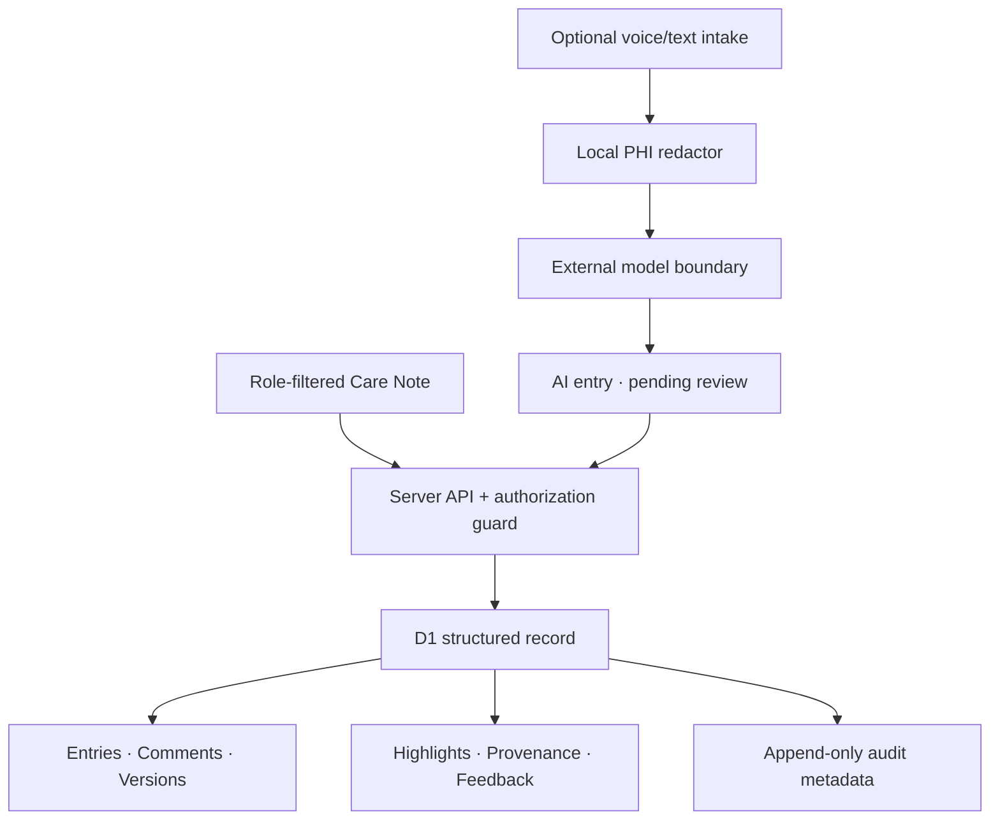

# Nightingale Care Note

A competition-ready prototype for the Nightingale 72HR Build: one shared, longitudinal patient note with a <10-second consult glance, role-safe collaboration, version history, source-linked AI summaries, and adaptive importance feedback.

> **Safety boundary:** every person, clinic, identifier, date, consultation and note in this repository is intentionally synthetic. This prototype does not claim HIPAA, PDPA or HCSA compliance and must not be used with real patient data.

## What the prototype demonstrates

- **Glance View:** four deliberately capped priority cards combining risk, recent change, open actions and patient context.
- **Exact provenance:** every highlight resolves to a source entry, source version and quoted span.
- **AI stays distinct:** AI doctor, nurse and patient-session summaries remain `system` entries with `pending_review` state; they never silently overwrite clinician notes.
- **Inline collaboration:** threaded comments and `@mentions` for staff and clinicians.
- **Revision safety:** immutable snapshots, version increments, history retrieval, revert-as-new-version and optimistic conflict detection.
- **Server-enforced RBAC:** the API derives the actor from an HttpOnly demo session and checks `role + clinic_id + section ownership` for every protected operation.
- **Trust feedback:** only clinicians may accept/reject an AI highlight; feedback changes the weight of similar future signals.
- **Append-only audit metadata:** actor, role, action, resource, outcome and before/after versions are recorded without copying raw note content into logs.
- **Pre-model redaction:** names, Singapore-style IDs, phone numbers and emails are removed before the model boundary; failure is fail-closed.

## Run locally

Requirements: Node.js 22.13+ and Python 3.10+.

```bash
npm ci
npm run dev
```

The deployed environment supplies the Cloudflare D1 `DB` binding. The app initializes only synthetic fixtures if the database is empty. The interface has an explicit demo-role switcher for Maya (patient), Aisha (staff), Dr. Lim (clinician) and Jordan (admin). It sets an HttpOnly synthetic demo session and reloads a server-filtered view.

### Tests

```bash
npm test
```

`npm test` runs the required Python micro-tests, builds the production Worker, and verifies the rendered product shell. To run only the domain micro-tests:

```bash
npm run test:micro
```

Included tests:

- `tests_py/test_rbac_scope.py`
- `tests_py/test_revision_history.py`
- `tests_py/test_highlight_provenance.py`
- `tests_py/test_concurrent_edits.py`
- `tests_py/test_self_learning_importance.py`
- `tests_py/test_redaction_before_llm.py`

Same-section edits use an expected version. The first writer succeeds; a stale writer receives a deterministic `409 Version conflict`. Staff and clinician sections are separate resources, so concurrent edits to different sections do not overwrite one another.

### Measure the warm-path Glance View

```bash
npm run bench:glance
```

The script performs five warm-up requests and 30 measured sequential requests against the built Worker, consumes each rendered response, and reports p50/p95/max. It approximates the warm SSR shell path, not internet transit or a production clinical SLA. The target is P95 ≤ 300 ms. Production telemetry should separately measure Worker time, D1 query time, region and cache state.

Latest recorded result: **P50 3.44 ms, P95 6.38 ms, max 10.58 ms**.

## Architecture



Data definitions live in `db/schema.ts`; the generated SQL migration lives in `drizzle/`. Runtime access is kept behind `db/store.ts`. The implementation intentionally separates:

- **Provenance:** how a particular version or highlight came to exist.
- **Audit event:** who read or changed a resource, when, and with what outcome.
- **Revision:** the recoverable content snapshot.

This follows the distinction in [HL7 FHIR R5 Provenance](https://hl7.org/fhir/provenance.html) and [AuditEvent](https://www.hl7.org/fhir/R5/auditevent.html).

## RBAC and trust rules

| Actor | Read | Write |
|---|---|---|
| Patient | Patient-visible summaries/instructions only | No internal notes/comments |
| Staff | Same-clinic staff, patient and shared AI context; no clinician-only sections | Staff notes and comments only |
| Clinician | All same-clinic entries and AI notes | Clinician sections, comments, highlight review |
| Admin | Same-clinic oversight and audit metadata | No clinical/staff note overwrite |

All denied operations are logged. UI visibility is never treated as authorization. The model mirrors OWASP’s server-side, deny-by-default guidance and field-level “minimum necessary” thinking; it does not use HIPAA as a claim of Singapore legal compliance. See [OWASP Broken Access Control](https://owasp.org/Top10/en/A01_2021-Broken_Access_Control/) and Singapore MOH’s [patient-data AI security requirements](https://www.moh.gov.sg/newsroom/data-security-requirements-apply-to-ai-tools-that-process-patient-data/).

## Where redaction happens

`lib/redaction.ts` runs before `lib/llm-gateway.ts` returns a model-ready payload. No external LLM call exists in this prototype. A real implementation should keep all external model traffic behind that single gateway, add vendor retention/contract checks, expand entity detection beyond regex, and block transmission whenever redaction confidence is insufficient. HHS recognizes formal Expert Determination and Safe Harbor pathways; simple regex replacement is not advertised here as certified de-identification. See [HHS de-identification guidance](https://www.hhs.gov/hipaa/for-professionals/special-topics/de-identification/index.html).

## Importance logic

The prototype’s explainable ranking model is:

`score = risk + recency + unresolved_action + clinical_entity + clinician_feedback`

Each card displays a plain-language `risk_reason`, AI/manual state and exact source. A clinician acceptance adds +12 to the relevant signal key; rejection subtracts 8. In production, feedback weights must be bounded, monitored for role/site bias, evaluated offline, and never be allowed to suppress hard-coded safety alerts.

## 72-hour scope decisions

- Built the highest-scoring trust loop end to end: **Glance → source → confirm/reject → version/audit**.
- Used deterministic synthetic fixtures rather than ingesting real EHR data.
- Implemented voice capture as an architectural boundary, not a real recorder; consent, diarization, noisy-room testing and multilingual terminology require separate validation.
- Stored full versions for clarity. At scale, use hot/warm/cold retention: recent full entries hot; older encounter summaries warm with source retained; cold encrypted archives governed by clinical/legal retention rules.
- Used a synthetic role switch rather than production identity. Replace it with clinic SSO and server-side membership claims before any real deployment.

## Deliverables

- Working application and tests
- `TECHNICAL_BRIEF.md` plus `output/pdf/nightingale-care-note-technical-brief.pdf`
- `DEMO_SCRIPT.md`
- `ATTRIBUTION.txt`
- Clear source history in Git

## Evidence base

High-impact design decisions were checked against [Singapore MOH](https://www.moh.gov.sg/newsroom/data-security-requirements-apply-to-ai-tools-that-process-patient-data/), [HL7 FHIR R5](https://hl7.org/fhir/provenance.html), [NIST AI RMF 1.0](https://www.nist.gov/publications/artificial-intelligence-risk-management-framework-ai-rmf-10), [HHS Security Rule guidance](https://www.hhs.gov/hipaa/for-professionals/security/laws-regulations/index.html), [OWASP](https://owasp.org/Top10/en/A01_2021-Broken_Access_Control/), and recent clinical evidence including a [Singapore time-motion study](https://medinform.jmir.org/2026/1/e85580/) and [AI-scribe note quality study](https://medinform.jmir.org/2026/1/e86474/).
