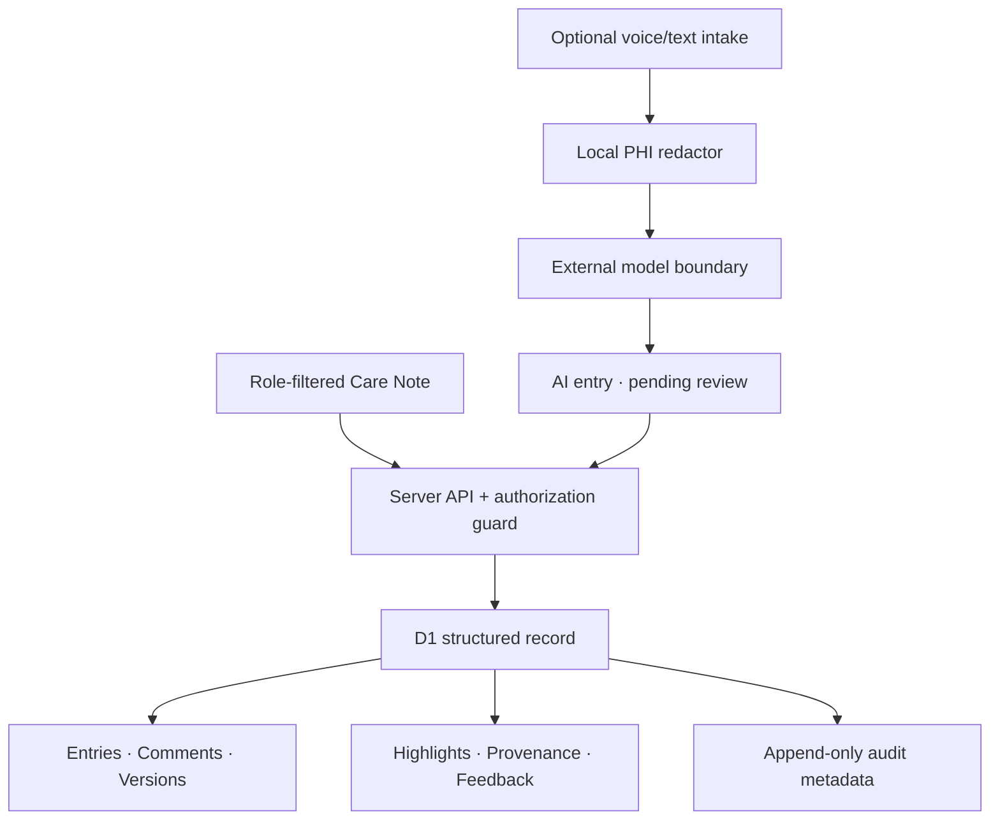

# Nightingale Care Note

A competition-ready prototype for the Nightingale 72HR Build: one shared, longitudinal patient note with a <10-second consult glance, role-safe collaboration, version history, source-linked AI summaries, and adaptive importance feedback.

> **Safety boundary:** every person, clinic, identifier, date, consultation and note in this repository is intentionally synthetic. This prototype does not claim HIPAA, PDPA or HCSA compliance and must not be used with real patient data.

## What the prototype demonstrates

- **Glance View:** four deliberately capped priority cards combining risk, recent change, open actions and patient context; every score exposes its component breakdown.
- **Exact evidence, not self-confidence:** every extracted highlight resolves to a source entry, version and literal span. Evidence coverage is `verified claims / total claims`; a broken span is removed rather than relabeled “medium confidence.”
- **Deterministic safety floors:** medication allergies cannot be demoted by model output or learned feedback.
- **Abstention and conflict handling:** same-medication/same-strength/different-frequency claims create a two-source conflict; patient-facing generation remains blocked until a clinician resolves it.
- **AI stays distinct:** AI doctor, nurse and patient-session summaries remain `system` entries with `pending_review` state; they never silently overwrite clinician notes.
- **Inline collaboration:** threaded comments and `@mentions` for staff and clinicians.
- **Revision safety:** immutable snapshots, version increments, history retrieval, revert-as-new-version and optimistic conflict detection.
- **Server-enforced RBAC:** the API derives the actor from an HttpOnly demo session and checks `role + clinic_id + section ownership` for every protected operation.
- **Bounded trust feedback:** only clinicians may review an AI highlight. Acceptance may add a small bounded positive weight; rejection is logged for evaluation but does not silently suppress future signals, and critical classes never learn a down-rank.
- **Append-only audit metadata:** actor, role, action, resource, outcome and before/after versions are recorded without copying raw note content into logs.
- **Pre-model redaction:** names, Singapore-style IDs, phone numbers and emails are removed before the model boundary; residual identifier patterns fail closed. The synthetic gate measures both identifier recall and preservation of clinical facts.

## Run locally

Requirements: Node.js 22.13+ and Python 3.10+.

```bash
npm ci
npm run dev
```

The deployed environment supplies the Cloudflare D1 `DB` binding. The app initializes only synthetic fixtures if the database is empty. The interface has an explicit demo-role switcher for Maya (patient), Aisha (staff), Dr. Lim (clinician) and Jordan (admin). It sets an HttpOnly synthetic demo session and reloads a server-filtered view.

### Tests

```bash
npm test
```

`npm test` runs the required Python micro-tests, builds the production Worker, and verifies the rendered product shell. To run only the domain micro-tests:

```bash
npm run test:micro
```

Included tests:

- `tests_py/test_rbac_scope.py`
- `tests_py/test_revision_history.py`
- `tests_py/test_highlight_provenance.py`
- `tests_py/test_concurrent_edits.py`
- `tests_py/test_self_learning_importance.py`
- `tests_py/test_redaction_before_llm.py`
- `tests_py/test_safety_evaluation.py`

The current domain suite contains **16 tests**. The safety tests deliberately inject a fabricated source span, a down-ranked critical alert, a rejected suggestion and a human-human dose contradiction to verify the corresponding abstention or escalation behavior.

Same-section edits use an expected version. The first writer succeeds; a stale writer receives a deterministic `409 Version conflict`. Staff and clinician sections are separate resources, so concurrent edits to different sections do not overwrite one another.

### Measure the warm-path Glance View

```bash
npm run bench:glance
```

The script performs five warm-up requests and 30 measured sequential requests against the built Worker, consumes each rendered response, and reports p50/p95/max. It approximates the warm SSR shell path, not internet transit or a production clinical SLA. The target is P95 ≤ 300 ms. Production telemetry should separately measure Worker time, D1 query time, region and cache state.

Latest recorded result: **P50 4.76 ms, P95 11.68 ms, max 12.50 ms**.

## Architecture



Data definitions live in `db/schema.ts`; the generated SQL migration lives in `drizzle/`. Runtime access is kept behind `db/store.ts`. The implementation intentionally separates:

- **Provenance:** how a particular version or highlight came to exist.
- **Audit event:** who read or changed a resource, when, and with what outcome.
- **Revision:** the recoverable content snapshot.

This follows the distinction in [HL7 FHIR R5 Provenance](https://hl7.org/fhir/provenance.html) and [AuditEvent](https://www.hl7.org/fhir/R5/auditevent.html).

## RBAC and trust rules

| Actor | Read | Write |
|---|---|---|
| Patient | Patient-visible summaries/instructions only | No internal notes/comments |
| Staff | Same-clinic staff, patient and shared AI context; no clinician-only sections | Staff notes and comments only |
| Clinician | All same-clinic entries and AI notes | Clinician sections, comments, highlight review |
| Admin | Same-clinic oversight and audit metadata | No clinical/staff note overwrite |

All denied operations are logged. UI visibility is never treated as authorization. The model mirrors OWASP’s server-side, deny-by-default guidance and field-level “minimum necessary” thinking; it does not use HIPAA as a claim of Singapore legal compliance. See [OWASP Broken Access Control](https://owasp.org/Top10/en/A01_2021-Broken_Access_Control/) and Singapore MOH’s [patient-data AI security requirements](https://www.moh.gov.sg/newsroom/data-security-requirements-apply-to-ai-tools-that-process-patient-data/).

## Where redaction happens

`lib/redaction.ts` runs before `lib/llm-gateway.ts` can return a model-ready payload. The gateway fails closed if a residual identifier pattern remains. The synthetic regression corpus asserts 100% removal of its required names, Singapore-style IDs, phone numbers and emails, while also asserting that medication names, doses and frequencies survive unchanged. This is a test-corpus result, not a production de-identification claim.

No external LLM call exists in this prototype. The gateway only returns an auditable [OpenAI Responses API](https://developers.openai.com/api/docs/guides/structured-outputs) request descriptor with `store: false` and a strict JSON schema. The prompt is extraction-only: each claim must copy an exact source span and offsets or abstain. Structured Outputs constrain shape, not truth, so a local verifier must still compare every quote and offset against the redacted source before storage. A real-data deployment also needs an organizational data-retention and contract review; OpenAI documents API training and retention controls separately in [Data controls](https://developers.openai.com/api/docs/guides/your-data). HHS formal de-identification guidance is used only as engineering caution, not as a Singapore compliance claim.

## Importance logic

The prototype’s inspectable ranking model is:

`score = risk + recency + unresolved_action + clinical_entity + clinician_feedback`

Each card displays the component values, a plain-language risk basis, evidence coverage, exact source and the action taken if validation fails. Risk is not delegated to an unconstrained ordinal model label: deterministic rules set the minimum severity for critical classes such as medication allergy.

Learning is intentionally asymmetric. A clinician acceptance adds a bounded `+4` to a non-critical signal family. A rejection is recorded with `eligible_for_learning = false` and changes no ranking weight, because non-exposure and alert fatigue make negative clicks ambiguous. Learned weights are clamped to `[-20, 20]`; critical classes ignore learned down-rank. A shadow holdout for exposure-bias measurement is a documented next validation gate, not a feature claimed as complete.

## Evaluation and abstention response to the added hint

| Question | Operational definition | How we know it is wrong | What happens when it is wrong |
|---|---|---|---|
| Extraction or generation? | Extraction copies claims plus literal quotes/offsets; patient instructions are a separate generation type. | Quote or offset does not resolve to the referenced entry version. | Remove the highlight from Glance and queue review; never paraphrase through the failure. |
| What is confidence? | The UI uses measured **evidence coverage**: `verified claims / total claims × 10,000 basis points`; it does not show model self-confidence. | Any claim lacks a verified source anchor. | Mark review-required or abstain; a patient draft cannot be released. |
| What is risk? | A rule/model score may rank items, but deterministic rules set a severity floor for critical classes. | A learned/model result falls below the rule floor. | Apply the floor and emit the rule ID, for example `RF-ALLERGY-001`. |
| Is redaction accurate? | Required identifiers removed while clinical facts remain unchanged on a labeled synthetic corpus. | False negative identifier or false positive clinical-term mutation. | Fail the pre-model gate; do not construct an external request. |
| Can the system learn safely? | Only bounded positive confirmation from eligible non-critical signals changes weight. | Critical down-rank, rejection-driven suppression or out-of-range weight. | Ignore the update, retain the audit/feedback record and raise an evaluation failure. |
| Are records contradictory? | `CF-DOSE-001` detects the same medication and strength with different frequencies across staff/clinician notes. | Two source quotes resolve and disagree. | Preserve both notes, show both sources, block patient release and require clinician resolution. |
| Can a patient see generated content? | Only `clinician_approved` or `rule_verified` patient-visible entries pass the server filter. | Draft, unresolved conflict or missing human approval. | Abstain from release; raw AI and its internal rationale remain hidden from the patient. |

## 72-hour scope decisions

- Built the highest-scoring trust loop end to end: **Glance → source → confirm/reject → version/audit**.
- Used deterministic synthetic fixtures rather than ingesting real EHR data.
- Implemented voice capture as an architectural boundary, not a real recorder; consent, diarization, noisy-room testing and multilingual terminology require separate validation.
- Kept extraction and generation separate. The current OpenAI request is an inspectable descriptor only; no API key, PHI or external model call is used.
- Stored full versions for clarity. At scale, use hot/warm/cold retention: recent full entries hot; older encounter summaries warm with source retained; cold encrypted archives governed by clinical/legal retention rules.
- Used a synthetic role switch rather than production identity. Replace it with clinic SSO and server-side membership claims before any real deployment.

## Deliverables

- Working application and tests
- `TECHNICAL_BRIEF.md` plus `output/pdf/nightingale-care-note-technical-brief.pdf`
- `DEMO_SCRIPT.md`
- `ATTRIBUTION.txt`
- Clear source history in Git

## Evidence base

High-impact design decisions were checked against [Singapore MOH](https://www.moh.gov.sg/newsroom/data-security-requirements-apply-to-ai-tools-that-process-patient-data/), [HL7 FHIR R5](https://hl7.org/fhir/provenance.html), [NIST AI RMF 1.0](https://www.nist.gov/publications/artificial-intelligence-risk-management-framework-ai-rmf-10), [HHS Security Rule guidance](https://www.hhs.gov/hipaa/for-professionals/security/laws-regulations/index.html), [OWASP](https://owasp.org/Top10/en/A01_2021-Broken_Access_Control/), and recent clinical evidence including a [Singapore time-motion study](https://medinform.jmir.org/2026/1/e85580/) and [AI-scribe note quality study](https://medinform.jmir.org/2026/1/e86474/).
